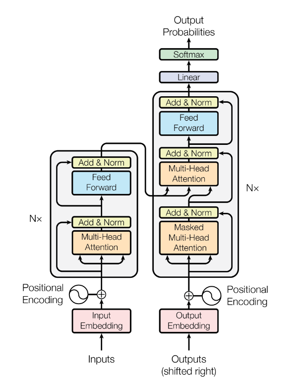
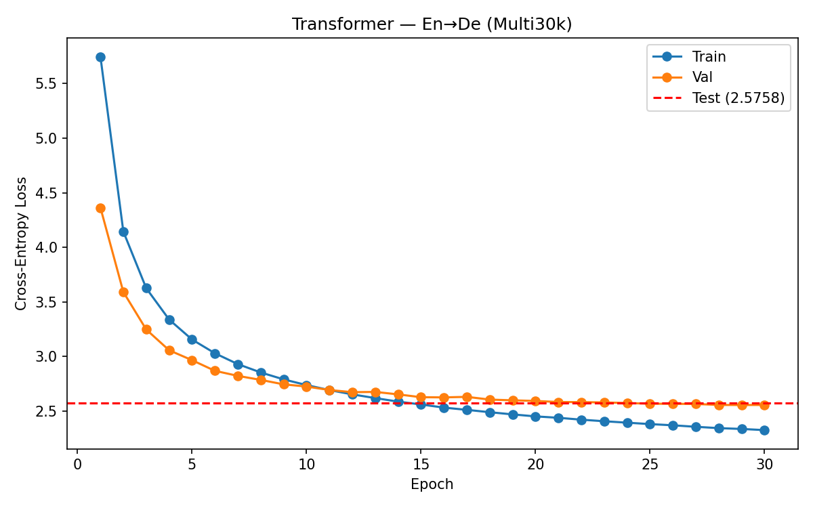

# Transformer — En→De Translation

A from-scratch PyTorch implementation of the Transformer ("Attention Is All You Need", Vaswani et al. 2017) trained on the **Multi30k** English→German dataset.

<p align="center">
  
</p>

## Results

Loss and BLEU on Multi30k (29k train / 1k val / 1k test pairs):

<p align="center">
  
</p>

| Epochs | Test loss | Test BLEU | Peak val BLEU |
|---|---|---|---|
| 30 | 2.58 | **39.55** | 39.12 |

## Installation

```bash
pip install -r requirements.txt
python -m spacy download en_core_web_sm
python -m spacy download de_core_news_sm
```

## Usage

Train from scratch:

```bash
python train.py
```

Monitor training in real time:

```bash
tensorboard --logdir runs
```

Outputs:
- `Models/checkpoint_epoch{NNN}.pt` — model weights, saved every 10 epochs
- `runs/transformer/` — TensorBoard event files
- `images/losses.png` — final loss plot

## Configuration

Hyperparameters are defined at the top of [`train.py`](train.py):

| Param | Value | Notes |
|---|---|---|
| `BATCH_SIZE` | 128 | |
| `EPOCHS` | 30 | |
| `D_MODEL` | 256 | Embedding / hidden dim |
| `N_LAYERS` | 3 | Encoder & decoder stacks |
| `N_HEADS` | 8 | Multi-head attention heads |
| `D_FF` | 512 | Feed-forward inner dim |
| `DROPOUT` | 0.4 | |
| `MAX_LEN` | 64 | Max sequence length |
| `WARMUP_STEPS` | 400 | Noam schedule warmup |
| `BLEU_MAX_LEN` | 64 | Max generation length for greedy decoding |

**Optimizer:** Adam, β=(0.9, 0.98), ε=1e-9, base `lr=1.0` so the Noam schedule provides the actual learning rate.

**Weight tying:** target embedding and output projection share the same `(target_vocab, d_model)` matrix.

**Initialization:** Linear weights use Xavier-uniform; embedding weights use `N(0, d_model^-0.5)`.

**Schedule:** Noam (Vaswani) inverse-square-root with linear warmup —
`lr = d_model^-0.5 · min(step^-0.5, step · warmup^-1.5)`.

**Loss:** Cross-entropy with `label_smoothing=0.1` and padding ignored.

**Eval:** Greedy decoding + corpus-level BLEU via `sacrebleu` (with `force=True` since outputs are pre-tokenized).

## Project Structure

```
transformer/
├── train.py                       # Training entry point
├── requirements.txt
├── README.md
├── LICENSE
├── images/
│   ├── transformer.png            # Architecture diagram
│   ├── losses.png                 # Latest training loss curves
│   └── pre_norm_encoder.png       # Pre-norm encoder block
└── src/
    ├── __init__.py
    ├── model.py                   # Transformer (encoder + decoder + projection)
    ├── encoder.py                 # Encoder + EncoderLayer
    ├── decoder.py                 # Decoder + DecoderLayer
    ├── attention.py               # scaled_dot_product_attention + MultiHeadAttention
    ├── feed_forward.py            # Position-wise FFN
    ├── positional_encoding.py     # Sinusoidal positional encoding
    ├── vocabulary.py              # Vocabulary class + special tokens
    ├── dataset.py                 # Multi30k loading + tokenization
    └── bleu.py                    # Greedy decoding + BLEU evaluation
```
## Dataset

Uses the **Multi30k** dataset (`bentrevett/multi30k`) via the 🤗 `datasets` library:

| Split | Pairs |
|---|---|
| Train | ~29,000 |
| Validation | ~1,000 |
| Test | ~1,000 |

Tokenization is handled by spaCy (`en_core_web_sm`, `de_core_news_sm`), lowercased, with vocabulary built from tokens appearing ≥ 2 times.

## License

MIT — see [`LICENSE`](LICENSE).
